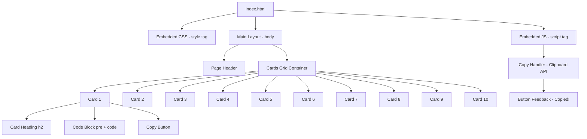
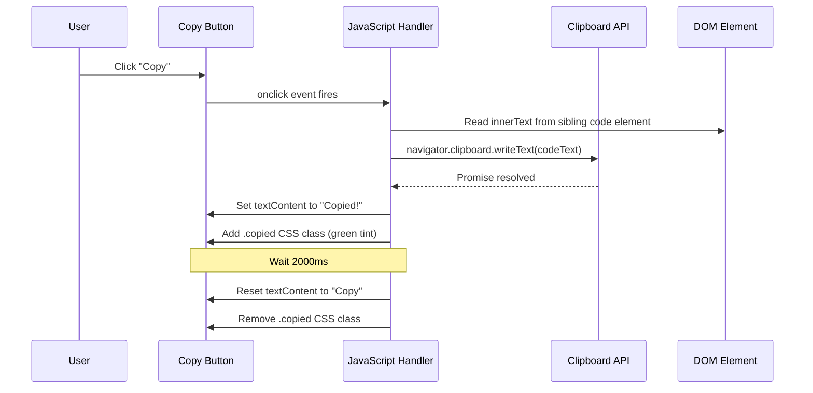

# Design Document: Lab Exam Reference Website

## Overview

A static, single-page reference website built with plain HTML, CSS, and JavaScript that displays 10 code snippet cards. Each card has a heading, a styled code block, and a "Copy" button that copies the code to the clipboard. The design is clean and minimal — no frameworks, no external dependencies.

The site is intended as a quick-reference tool during lab exams, so readability and fast interaction are the primary goals.

---

## Architecture



---

## Sequence Diagrams

### Copy Button Interaction Flow



---

## Components and Interfaces

### Component 1: Page Shell (`index.html`)

**Purpose**: Single HTML file that contains all markup, styles, and scripts inline. No external files needed.

**Interface**:
```html
<!DOCTYPE html>
<html lang="en">
  <head>
    <meta charset="UTF-8" />
    <meta name="viewport" content="width=device-width, initial-scale=1.0" />
    <title>Lab Exam Reference</title>
    <style>/* styles */</style>
  </head>
  <body>
    <header>...</header>
    <main class="grid">...</main>
    <script>/* scripts */</script>
  </body>
</html>
```

**Responsibilities**:
- Serve as the single deliverable file
- Host all 10 cards inside a CSS grid container
- Embed styles and scripts to avoid external dependencies

---

### Component 2: Card (`.card`)

**Purpose**: A self-contained unit displaying one code snippet with a heading and copy button.

**Interface**:
```html
<div class="card">
  <h2 class="card-title">Heading Text</h2>
  <div class="code-wrapper">
    <pre><code class="code-block">/* code here */</code></pre>
    <button class="copy-btn" onclick="copyCode(this)">Copy</button>
  </div>
</div>
```

**Responsibilities**:
- Display a descriptive heading
- Render code in a monospace, scrollable block
- Provide a Copy button that triggers the clipboard handler

---

### Component 3: Copy Handler (`copyCode` function)

**Purpose**: JavaScript function that reads the code text from a card and writes it to the system clipboard.

**Interface**:
```javascript
function copyCode(buttonElement) {
  // buttonElement: the clicked <button> DOM node
  // Returns: void (side effects only)
}
```

**Responsibilities**:
- Traverse from the button to the sibling `<code>` element
- Use `navigator.clipboard.writeText()` to copy text
- Provide visual feedback by changing button label to "Copied!" for 2 seconds
- Gracefully handle clipboard API errors (fallback or silent fail)

---

## Data Models

### Card Data Structure (Conceptual)

Each card is represented as static HTML. Conceptually, each card has:

```javascript
// Conceptual model — not a runtime object, just describes card content
{
  id: Number,          // 1–10, unique identifier
  title: String,       // Heading displayed at top of card
  code: String         // Multi-line code string shown in the code block
}
```

**Validation Rules**:
- `id` must be between 1 and 10 (exactly 10 cards total)
- `title` must be a non-empty string
- `code` must be a non-empty string; whitespace and indentation are preserved

---

## Algorithmic Pseudocode

### Main Copy Algorithm

```pascal
PROCEDURE copyCode(buttonElement)
  INPUT: buttonElement — the DOM button node that was clicked
  OUTPUT: void (side effects: clipboard updated, button label changed)

  PRECONDITIONS:
    - buttonElement is a valid DOM node of type <button>
    - buttonElement has a parent .code-wrapper containing a <code> element
    - navigator.clipboard is available (modern browser)

  POSTCONDITIONS:
    - Clipboard contains the full innerText of the <code> sibling element
    - buttonElement.textContent = "Copied!" for 2000ms, then resets to "Copy"
    - No mutation to the code content itself

  SEQUENCE
    codeElement ← buttonElement.parentElement.querySelector("code")
    codeText    ← codeElement.innerText

    TRY
      AWAIT navigator.clipboard.writeText(codeText)
      buttonElement.textContent ← "Copied!"
      buttonElement.classList.add("copied")

      WAIT 2000ms

      buttonElement.textContent ← "Copy"
      buttonElement.classList.remove("copied")
    CATCH error
      // Clipboard write failed (e.g., permissions denied)
      // Silently ignore — no UI change
    END TRY
  END SEQUENCE
END PROCEDURE
```

**Loop Invariants**: N/A — no loops in this procedure.

---

### Page Load Algorithm

```pascal
PROCEDURE onPageLoad()
  INPUT: none
  OUTPUT: void (DOM rendered by browser)

  PRECONDITIONS:
    - HTML document is fully parsed
    - All 10 .card elements exist in the DOM

  POSTCONDITIONS:
    - All copy buttons are interactive
    - No JavaScript initialization required beyond function definition

  SEQUENCE
    // No explicit init needed.
    // copyCode() is bound via inline onclick attributes.
    // Browser handles rendering of pre/code blocks natively.
  END SEQUENCE
END PROCEDURE
```

---

## Key Functions with Formal Specifications

### `copyCode(btn)`

```javascript
function copyCode(btn) { ... }
```

**Preconditions:**
- `btn` is a `<button>` element inside `.code-wrapper`
- `.code-wrapper` contains exactly one `<code>` child element
- `navigator.clipboard` is defined and accessible

**Postconditions:**
- `navigator.clipboard.writeText` is called with the full text of the `<code>` element
- `btn.textContent` becomes `"Copied!"` immediately after successful write
- After 2000ms, `btn.textContent` reverts to `"Copy"`
- The `.copied` CSS class is added then removed on the same schedule
- The `<code>` element's content is not modified

**Error Handling:**
- If `navigator.clipboard.writeText` rejects, the catch block silently swallows the error
- Button label does not change on failure

---

## Example Usage

```html
<!-- Card 1: Hello World -->
<div class="card">
  <h2 class="card-title">Hello World</h2>
  <div class="code-wrapper">
    <pre><code class="code-block">#include &lt;stdio.h&gt;

int main() {
    printf("Hello, World!\n");
    return 0;
}</code></pre>
    <button class="copy-btn" onclick="copyCode(this)">Copy</button>
  </div>
</div>
```

```javascript
// Copy handler — called by onclick on each button
async function copyCode(btn) {
  const code = btn.parentElement.querySelector('code').innerText;
  try {
    await navigator.clipboard.writeText(code);
    btn.textContent = 'Copied!';
    btn.classList.add('copied');
    setTimeout(() => {
      btn.textContent = 'Copy';
      btn.classList.remove('copied');
    }, 2000);
  } catch (err) {
    // clipboard unavailable — fail silently
  }
}
```

---

## Correctness Properties

- **P1 — Completeness**: For all cards `c` in `[1..10]`, `c` has exactly one `.card-title`, one `<code>` block, and one `.copy-btn`.
- **P2 — Copy Fidelity**: For all copy button clicks, the text written to the clipboard equals `code.innerText` without modification.
- **P3 — Button Reset**: For all successful copy operations, the button label returns to `"Copy"` after exactly 2000ms.
- **P4 — No Mutation**: The `<code>` element's content is never modified by any JavaScript operation.
- **P5 — Independence**: Clicking the copy button on card `i` does not affect the state of any other card `j` where `j ≠ i`.
- **P6 — Idempotency**: Clicking the copy button multiple times in succession always copies the current code text; no stale state is retained.

---

## Error Handling

### Error Scenario 1: Clipboard API Unavailable

**Condition**: `navigator.clipboard` is undefined (non-HTTPS context, old browser, or permissions denied).  
**Response**: The `try/catch` block catches the rejection. No UI change occurs.  
**Recovery**: User can manually select and copy the code from the `<pre>` block.

### Error Scenario 2: Empty Code Block

**Condition**: A `<code>` element exists but has no text content.  
**Response**: `writeText("")` is called — clipboard is cleared. Button still shows "Copied!".  
**Recovery**: Not a runtime error; content should be populated at authoring time.

### Error Scenario 3: Missing `<code>` Element

**Condition**: `querySelector('code')` returns `null` (malformed HTML).  
**Response**: `null.innerText` throws a `TypeError`, caught by the `catch` block.  
**Recovery**: Silently ignored. Fix requires correcting the HTML structure.

---

## Testing Strategy

### Unit Testing Approach

Since this is a plain HTML/JS file with no build system, testing is done manually or with a lightweight test harness:

- Verify all 10 cards render with a heading, code block, and copy button
- Verify clicking each copy button changes label to "Copied!" within 100ms
- Verify button label resets to "Copy" after ~2 seconds
- Verify clipboard content matches the code block text exactly

### Property-Based Testing Approach

Not applicable for this static site. The correctness properties (P1–P6) above serve as the formal specification for manual verification.

### Integration Testing Approach

- Open `index.html` in a browser (Chrome, Firefox, Edge)
- Confirm layout renders correctly at 1280×720 and 375×667 (mobile)
- Confirm copy works in each browser (clipboard API support varies)
- Confirm no console errors on load or button click

---

## Performance Considerations

- Single HTML file — no network requests, no render-blocking resources
- All 10 cards are rendered at page load (no lazy loading needed at this scale)
- `setTimeout` for button reset is lightweight and does not block the main thread
- `<pre>` blocks with long code may cause horizontal scroll — `overflow-x: auto` handles this

---

## Security Considerations

- No user input is accepted — no XSS risk
- `navigator.clipboard.writeText` only writes to clipboard; it does not read from it
- No external scripts, fonts, or stylesheets — no supply chain risk
- HTML entities (`&lt;`, `&gt;`, `&amp;`) must be used inside `<code>` blocks for any code containing `<`, `>`, or `&` to prevent unintended HTML parsing

---

## Dependencies

- **None** — plain HTML5, CSS3, and vanilla JavaScript only
- Clipboard API (`navigator.clipboard`) — available in all modern browsers on HTTPS or localhost
- Mermaid diagrams in this document are for documentation purposes only; not used in the website itself
